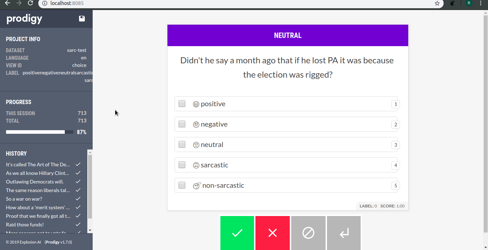

# RedditSent Models

This project is created as a part of the Advanced Natural Language Processing (ANLP 2018) course at Universität Potsdam, Germany.   

## 0. Setup

`sudo apt-get install python3-venv`

`virtualenv --python=python3.6 venv`

`source venv/bin/activate`

`pip install -r requirements.txt`

`spacy download en_core_web_lg`

## 1. Benchmarking against the *SARC* dataset 

Self-Annotated Reddit Corpus [(*SARC*)](https://github.com/NLPrinceton/SARC) is the largest publicly available annotated corpus for reddit comments. We utilise comments from the balanced section of the corpus to benchmark our future models. 

### 1.1 SARC Baseline
The SARC corpus provides a simple baseline: Average of glove embeddings fed into a logit classifier. We describe several different architectures which perform better. 

### 1.2 Byte-Pair Encoding
Byte-Pair Encodings or [*BPE*](https://github.com/bheinzerling/bpemb) provide tokenisation with subword-level features. We feed this into a TF-IDF + Logit pipeline. 

([See](utils/classifiers/baseline+subword.ipynb))

### 1.3 Fasttext + Pretrained Vectors
Using the corpus described in Part 2, we create a dense unsupervised representation of the reddit vocabulary. These "pretrained" vectors are then finetuned using the SARC training files, after which we apply a softmax. 

([See](docs/vectors.md))

### 1.4 BERT + BiDirectional LSTM
([Code](utils/classifiers/bert-hp.py))

([Hyperparam Search Results](results/bert_param_selection.txt))

### Results

([See](docs/results.md))

## 2. Building Topical Corpora via *Pushshift*

[*Pushshift*](http://pushshift.io/) is a free service that ingests real-time comments from Reddit. We query its API to create a corpus of comments from 5 of the biggest English-language political subreddits - [r/politics](http://reddit.com/r/politics), [r/news](http://reddit.com/r/news/), [r/worldnews](http://reddit.com/r/worldnews/), [r/unitedkingdom](http://reddit.com/r/unitedkingdom), [r/europe](http://reddit.com/r/europe/). The corpus has around 7.5m comments and  150m word tokens. It is available [**here**](https://tinyurl.com/y5rkylj4).

1. [Lexicons](docs/lexicons.md)
2. [Data Scrape](docs/data.md)
3. [Filtering and Preprocessing](docs/preprocessing.md)
4. [Word Vectors](docs/vectors.md)

## 3. Data Annotation using *Prodigy* 

Using the corpus created above, we annotate a subset of comments from [r/politics](https://reddit.com/r/politics/). To perform data annotation, we use [*Prodigy*](https://prodi.gy/) with a custom [recipe](utils/prodigy/recipe.py). 

**Note**: Prodigy is not a free software

[Try Prodigy](https://redditsent-corpus.serveo.net/) with our r/politics corpus. 

### TODO
0. Finish Documentation
1. Dockerize
2. Extend Annotations
3. Extend Graphs
4. Move files to S3
5. Add Sentence Vectors
6. Citations