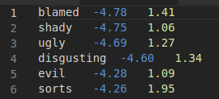
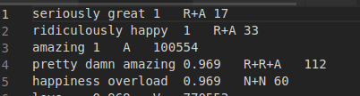

Lexicons were taken from multiple sources:
1. [SocialSent](https://nlp.stanford.edu/projects/socialsent/) : Hamilton, Clark, Leskovec, and Jurafsky (2016) note how a word’s sentiment depends on the domain in which it is utilized.
They also release domain-specific sentiment
lexicons in the form of SocialSent. This is a relatively recent development as previous NLP research ignored domain-specific lex-
icons, instead focusing on generic domain-
independent lexicons. Since our corpus is de-
signed for sentiment analysis tasks, we query
Pushshift with keywords from these domain
lexicons.

    

2. [SCL-OPP](http://www.saifmohammad.com/WebPages/SCL.html) : Mohammad and Kiritchenko (2015) release Sen-
timent Composition Lexicon of Opposing
Polarity Phrases (SCL-OPP), which includes
phrases that have at least one positive and
at least one negative word eg. phrases like
‘happy accident’ and ‘best winter break’.
Querying these phrases lets us capture lin-
guistic patterns of opposing polarity. This
is important as using a diverse set of lexi-
cons minimizes the impact of subject-specific
words from any given community.

    

### To Build From Scratch

`wget https://nlp.stanford.edu/projects/socialsent/files/socialsent_subreddits.zip -P data/lexicons`

`unzip data/lexicons/socialsent_subreddits.zip -d data/lexicons`

`python utils/build_lexicons -lexicon_file data/lexicons/lexicon_file.txt -outfile data/lexicons/new_lexicons.txtx`